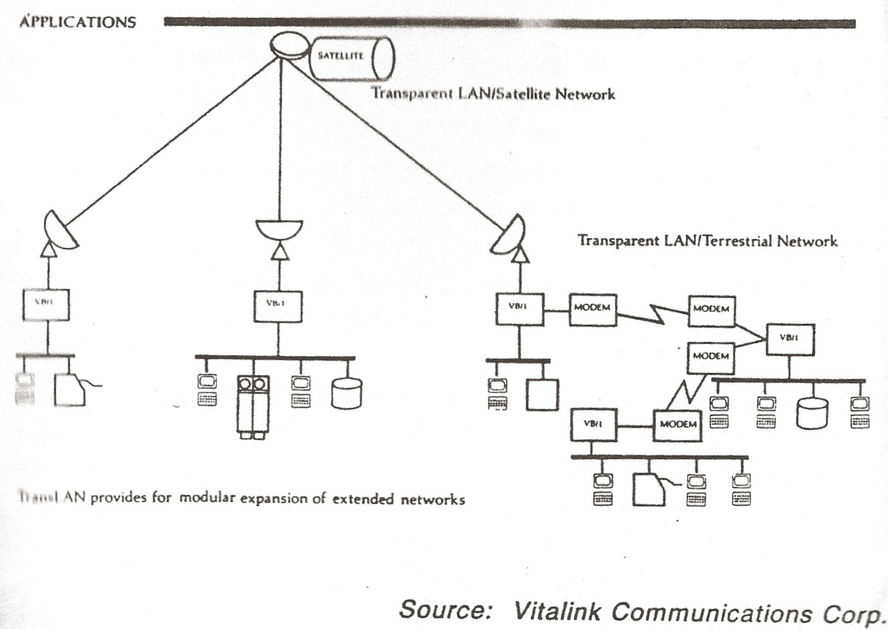

Most corporations fail; investors suffering a loss of all or most of their investments. Yet there are a few lucky corporations that are able to overcome the odds and discover a path that leads to success. The story of Vitalink is one of management willing to face the failure of their founding strategy and steer their company into the strong currents of a growth market before it was too late.

When the founders incorporated Vitalink in 1980, they had an initial strategy to build private, corporate satellite data communications systems.<a name="fnloc100" href="#fn100">100</a>  By 1984, what was once a promising opportunity had turned into a capital-intensive, fiercely, competitive market. Seeking out a new niche to leverage their competences and past investments, Vitalink teamed up with Digital Equipment Corporation (DEC) to solve mutual, yet distinctly different, problems. At the time, DEC sought a solution for interconnecting multiple Ethernet LANs primarily within a building. Given their experience interconnecting different kinds of networks, it was natural for Vitalink to bring to the collaboration ideas for interconnecting multiple, disparate Ethernets. A result of their cooperation was the creation of the first remote bridge, to be sold as Vitalink’s TransLAN. (See Exhibit 12.16 Vitalink’s TransLAN) The TransLAN interconnected one Ethernet LAN to as many as eight long-haul networks, via either terrestrial or satellite links. Vitalink and DEC next signed expanded co-development and co-marketing agreements. Vitalink would benefit by selling its TransLAN to potential customers generated from DEC’s marketing systems. (Surprisingly however, Vitalink OEM’d the TransLAN Ethernet hardware from Bridge Communications, not DEC.<a name="fnloc101" href="#fn101">101</a>)

By mid-1986, financial constraints forced Vitalink management into uncharted strategic territory. Intense competition in the private satellite business had made it difficult to grow revenue or attain profitability. Challenged, management took two actions. First, they decided to narrow their satellite strategy to the new Vsat technologies and cease building private networks requiring special programing and development. Informing their decision was the fact that 80% to 90% of TransLAN products ran over terrestrial lines,<a name="fnloc102" href="#fn102">102</a> and since it was TransLAN that was growing revenues, refocusing the satellite business to support TransLAN. The more modest Vsat strategy still leveraged past satellite investments while, hopefully, serving the same users who were purchasing their remote bridges. Secondly, the sales success of remote bridges demanded more investment and management attention. In October 1986, the management of Vitalink announced a strategic repositioning: to create products filling out their 802 WAN architecture, and cease providing of wide-area networks.<a name="fnloc103" href="#fn103">103</a> Vitalink would focus on interconnecting local area networks using the 802.3 standard. TransLAN would support DECnet, XNS, TCP/IP and similar higher-level protocols. Increased bridge investment led to two new communication software packages, TransSDLC, and the new TransLINK, a frame level multiplexer. Despite these painful choices, the company was still losing money. Pressed for cash, they refinanced their capital equipment and raised $5.5 million, funds needed for product development and working capital.<a name="fnloc104" href="#fn104">104</a>  The good news was that company revenues for 1986 were about to double to $10 million on the strength of remote-bridge sales. The TransLAN represented more than 50% of Vitalink’s revenues.

### Exhibit 14.23.1  Vitalink TransLAN (1985)<a name="fnloc105" href="#fn105">105</a>

Continuing the drive for innovation and competitive advantage, in early 1987, Vitalink and DEC announced a second important result of their co-development agreement: the Spanning Tree Protocol (STP). The STP addressed the need to create loop-free transmission within a topology of Ethernet LANs interconnected with bridges.<a name="fnloc106" href="#fn106">106</a> Before STP, users had to manually interconnect all nodes within a bridge network in order to know that there were no loops; for if loops existed, the entire network could be driven into an overloaded state and cease working.

The continued double-digit growth of remote-bridge revenues, and the success of the DEC relationship, prompted management to next take an even more drastic and bold decision. In mid-1987, management decided to stop making any investments in the satellite business and to put it on the market for sale, and absent a buyer within a year, to completely close the business down. By the fall, finding little interest among potential buyers, one of the company’s founders, Al Horley, then responsible for the satellite business, resigned in order to negotiate its purchase. Although having minimized the cash drain on Vitalink, the growth of the bridge business required cash. Fortunately the bridge market, and the Internetworking market in general, had become recognized as a “hot” market and investment bankers were calling on Vitalink management and pitching the idea of an IPO now that the satellite business had been in principal terminated.

With revenues of $17.5 million for the fiscal year 1987, and growth of the bridge business exceeding 100%, Vitalink now had access to the public market and the capital they needed to properly finance their growth. On March 3, 1988, Vitalink went public at a price of $8.25/share, selling 2.3 million shares and raising nearly $19 million with a company valuation of $44 million.

Nearing the deadline they had set for the sale or closure of the satellite business, in September 1988, Horley organized a new company, Vitacom, and negotiated the final sale of the business for a undisclosed sum.<a name="fnloc107" href="#fn107">107</a>

Then in November 1988, Vitalink and DEC signed a new agreement giving DEC the right to resell Vitalink’s TransLAN product line directly to its customers. It was likely that this agreement expanded the number of people selling the TransLAN by a factor of ten.

1988 was another great year for Vitalink with profitable revenues of $37.4 million.<a name="fnloc108" href="#fn108">108</a>  Vitalink was thought to control 70% of the remote bridge market.
