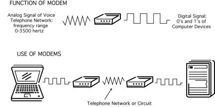

Footnotes
=========
`<a name="fnloc1" href="#fn1">1</a>`

**name="fnloc1"** - tells the footnote what location to link back to in the paragraph it was clicked on from.

**href="#fn1"**  - tells the number link, when clicked, to jump to the source of the footnote (which will be listed at the bottom of the page)

The creation of new knowledge precedes the possibility of new ideas leading to new products holding economic promise.<a name="fnloc1" href="#fn1">1</a> So we must first understand how new knowledge is created and diffused in order to understand the process of technological innovation becoming economic growth. Consequently, the history of computer communications begins long before working high-speed modems or an Arpanet. Retracing the experiences of individuals and the source of their inspirations and ideas is a reoccurring theme throughout this history.<a name="fnloc2" href="#fn2">2</a> For the mental models of scientists, engineers and entrepreneurs are deeply embedded in their formative experiences and thus invariably shape their ability to adapt their perspectives onto an ever-changing competitive landscape.<a name="fnloc3" href="#fn3">3</a>

Images
======

``

**alt text** - First and foremost used for web accessibility for visually impaired users. Though it also provides context for search engines for indexing the image.

**{{ site.baseurl }}** - This makes sure that regardless of permalinks or url updates ect... that the image will always be linked correctly

**/path/to/image.jpg** - the path to where the image is located, in our case it will usally be /assets/img/image.jpg

Here is an example of an image with a H3 heading above it. (i've ommited the `{{ site.baseurl }}` to show a better preview as this is not markdown but unique to Jekyll and its build process)

### Example of the two types of modem ideas

Basic Markdown Syntax
=====================

# H1
## H2
### H3
#### H4
##### H5
###### H6

Bold - **This is how you make bold text**

Italic - *Thisc  italicizes the text*

Blockquote
> This is  a block quote, isn't it so neat!

Ordered List
1. First item
2. Second item
3. Third item

Unordered List
- First item
- Second item
- Third item

Link - [text that you want to be the link](https://www.example.com)

Ready to get fancy? Here is a [link](https://www.example.com) in a paragraph.

Image -	

Tables:

This is a pretty table:

| Syntax     | Description    | Some other heading |
| ------     | -----------    | ------------------ |
| Header     | Title          | neat               |
| Paragraph  | Text           | right on           |
| Blockquote | dat quote bruh | cool               |

This is an ugly table but yields the same results:

| Syntax | Description | Some other heading |
| --- | --- | --- |
| Header | Title | neat |
| Paragraph | Text | right on |
| Blockquote | dat quote bruh | cool |

probably won't need this one but wraping text in backticks ` tell it that you want to show the code as text and to just print it out rather then render it as html.

These each make an H2 heading:
<h2 class="coolheading">My H2 heading</h2>

## My H2 heading

Wraping in backticks prints the code as text:

`<h2 class="cool-class">My H2 heading</h2>`

`## My H2 heading`

